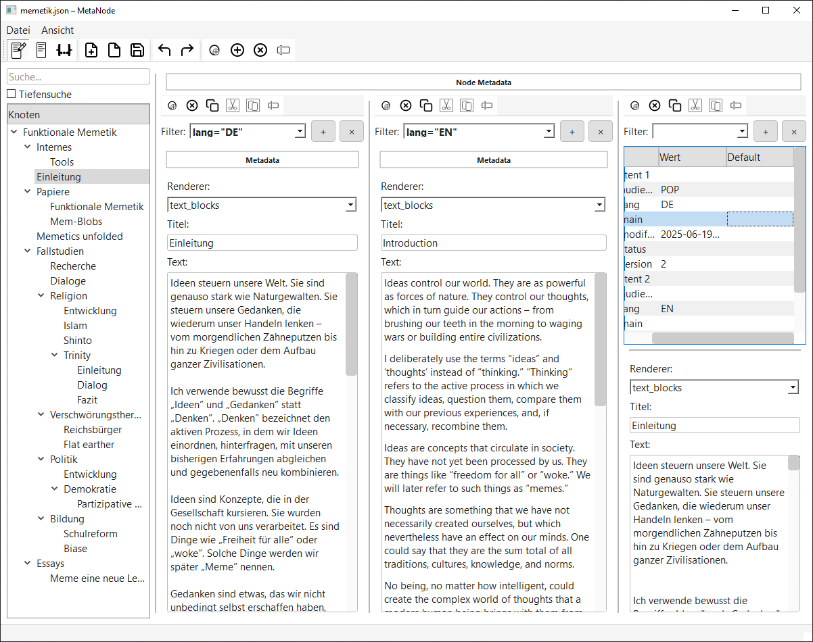

# MetaNode

**MetaNode** is a modular, schema-driven editor for hierarchical structures (trees), where each node can contain multiple content variants — for different languages, audiences, or purposes.

> 🛠️ **Work in Progress**  
> MetaNode is under active development. Expect rapid improvements and breaking changes.

## 🧠 Why MetaNode?

Writing complex content for **multiple target groups** or **in several languages** often leads to chaos — duplicated files, endless folders, or tangled markup.  
MetaNode brings structure into this mess:

- Each **node** holds its own **metadata** and a list of **contents**
- Each **content** is versioned by metadata (e.g. `lang`, `audience`, `version`)
- Multiple **edit panels** let you filter, view and edit in parallel

Whether you're documenting software, writing educational materials, or mapping a fictional world — MetaNode helps you **manage versions without redundancy**.



## 🔧 Key Features

- **Tree-based Node Editor**
  - Add, rename, move, delete nodes
  - Search with optional deep-search
  - Full drag-and-drop with undo support

- **Multi-Content Architecture**
  - Each node can hold multiple contents (text, image, HTML, etc.)
  - Each content has structured metadata (e.g. language, audience, version)

- **Filterable, Multi-Panel Editing**
  - Define content filters (e.g. `lang = "DE" AND audience = "POP"`)
  - Open several filtered views side-by-side
  - Each panel shows a table of matches + live editor

- **Extensible Renderers**
  - New content types and renderers can be added
  - Current default: `text_blocks` for plain/structured text

- **Schema-Based Validation**
  - Node and content metadata are driven by JSON Schema
  - UI adapts to the defined fields

- **Undo/Redo**
  - Tree and content changes are tracked separately
  - Keyboard shortcuts: `Ctrl+Z`, `Ctrl+Y`

## 📦 Example Use Cases

- Multilingual documentation with audience-specific content
- Educational books with POP/SCI/INT tracks
- World-building tools (chapters, notes, internal lore)
- Legal or technical documents with layered annotations

## 🚀 Getting Started

```bash
pip install PyQt5
python main.py
```

## 📁 Project Structure

MetaNode is organized into clear subfolders:

- `models/` – Data classes for nodes, contents, metadata, and tree logic  
- `ui/` – Main window and layout modules for tree, editor, and panels  
- `widgets/` – Modular editor widgets for content and metadata  
- `core/` – Filtering, schema registry, undo, and path utilities  
- `schemas/` – JSON Schemas for metadata structure  
- `resources/` – Icons, examples, and saved trees  
- `specs/` – Project specs, todos, and internal documentation

📄 For a detailed architectural breakdown, see [`static/2_Project_Structure.md`](static/2_Project_Structure.md)


## 📜 License

MetaNode is released under the [MIT License](LICENSE).

## 🧾 Disclaimer and Origin

MetaNode was born out of necessity. As a process engineer, I write specifications for various stakeholders — clients, mechanical, electrical, and software teams. I also work on a book about memetics that requires multilingual, multi-level content. Managing all these versions in Access became too painful.

So I switched to Python and PyQt. ChatGPT (4o) — codename "Kai" — was my sparring partner throughout. Many architectural decisions emerged from these dialogues. Thanks to OpenAI for creating such a brilliant tool. What a time to build.

## ⚡ July 2025: Major Refactor & JSON Editing Policy


## 🪟 Custom Splitter & UI Improvements (2025-07-05)

- All splitters (main, content, per-panel) now use a custom `CustomSplitter`/`CustomSplitterHandle`:
    - Prevents full collapse, always shows a visible, labeled handle.
    - Draws a label for collapsed regions (rotated for horizontal splitters).
    - Label dynamically reflects the content of the hidden/collapsed panel, or uses explicit label from `addWidget`.
    - Robustly saves/restores layout state as ratios.
    - Visually clean, theme-aware, and does not overlap content.
    - All code is maintainable, modular, and documented.
- All major UI components are modularized (tree view, content panel, main window) using mixins and manager/helper modules.
- Debug code and unused imports removed, docstrings added, linter warnings minimized.

For more, see [`refactoring.md`](refactoring.md) and [`PROJECT_OVERVIEW.md`](PROJECT_OVERVIEW.md).
