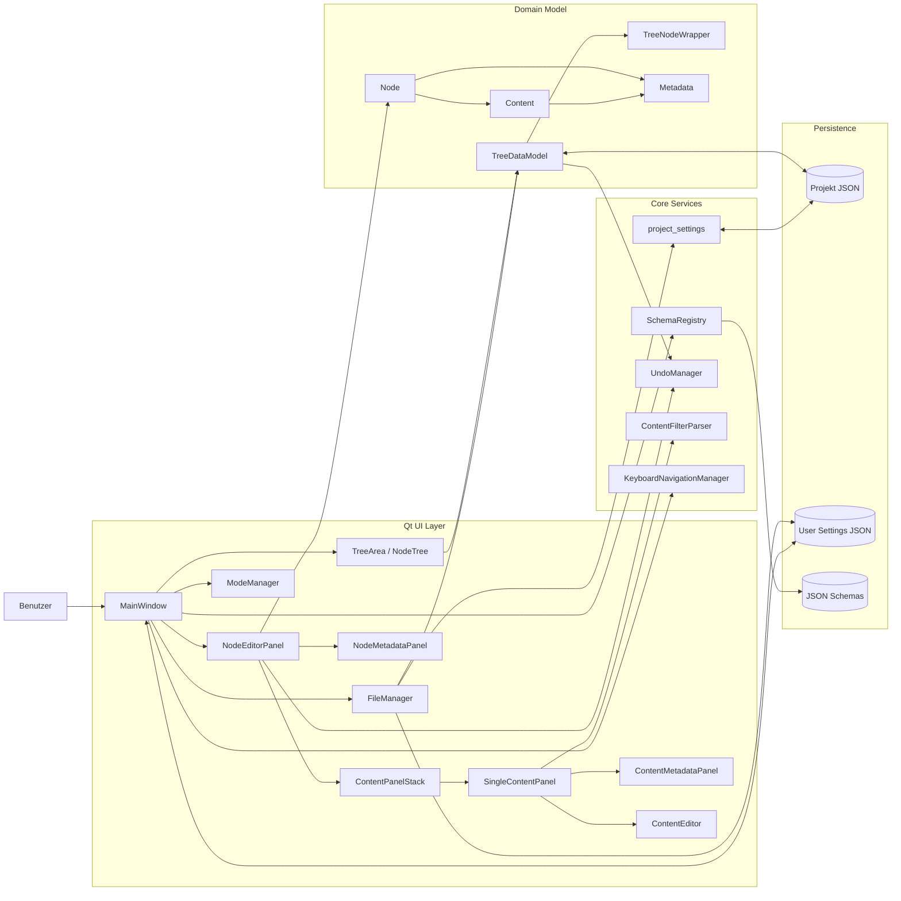

# High-Level-Architektur (C4-ish)

**Legende**
- `UI`: Qt Widgets, Fenster, Panels
- `Domain`: Baum-/Node-/Content-Objekte
- `Core Services`: Schema, Filter, Undo, Layout/Pfade
- `Persistence`: JSON-Dateien (Projekt + User-Settings)

**Basiert auf**
- `main.py::main`
- `ui/main_window.py::MainWindow`
- `ui/file_manager.py::FileManager`
- `models/tree_data.py::TreeDataModel`
- `ui/node_editor_panel.py::NodeEditorPanel`
- `widgets/content_panel_stack.py::ContentPanelStack`
- `widgets/single_content_panel.py::SingleContentPanel`
- `core/schema_registry.py::SchemaRegistry`
- `core/project_settings.py`
- `utils/user_settings.py`

