# Modul-Abhängigkeiten (Pakete/Module)

**Legende**
- Pfeil `A --> B`: `A` importiert bzw. nutzt `B`.
- Diagramm zeigt v. a. Runtime-relevante Module (kein vollständiger statischer Importgraph).

**Basiert auf**
- Imports aus `main.py`, `ui/*.py`, `widgets/*.py`, `models/*.py`, `core/*.py`, `utils/user_settings.py`

```mermaid
flowchart TD
    mainpy[main.py]

    subgraph ui
      mw[ui.main_window]
      ta[ui.tree_area]
      tv[ui.tree_view]
      nep[ui.node_editor_panel]
      fm[ui.file_manager]
      nsm[ui.node_selection_manager]
      mm[ui.mode_manager]
      psm[ui.panel_state_manager]
      sm[ui.splitter_manager]
      jem[ui.json_editor_manager]
      umh[ui.undo_manager_helper]
      csplit[ui.custom_splitter]
    end

    subgraph widgets
      cps[widgets.content_panel_stack]
      scp[widgets.single_content_panel]
      nmp[widgets.node_metadata_panel]
      cmp[widgets.content_metadata_panel]
      ceb[widgets.content_editor_base]
      cef[widgets.content_editor_factory]
      je[widgets.json_editor]
      nrp[widgets.node_read_panel]
    end

    subgraph models
      tdm[models.tree_data]
      node[models.node_model]
      content[models.content_model]
      meta[models.metadata_model]
    end

    subgraph core
      sr[core.schema_registry]
      ps[core.project_settings]
      um[core.undo_manager]
      cfp[core.content_filter_parser]
      km[core.keyboard_manager]
      pp[core.project_paths]
    end

    subgraph utils
      us[utils.user_settings]
      ratios[utils.ratios]
    end

    mainpy --> mw

    mw --> ta
    mw --> nep
    mw --> fm
    mw --> sr
    mw --> km
    mw --> us
    mw --> csplit

    ta --> tv
    tv --> tdm

    nep --> nmp
    nep --> cps
    nep --> node
    nep --> content
    nep --> um

    cps --> scp
    cps --> content
    cps --> ratios
    cps --> csplit

    scp --> cmp
    scp --> content
    scp --> cfp
    scp --> cef
    scp --> csplit
    scp --> pp

    cef --> ceb
    cef --> je

    fm --> tdm
    fm --> node
    fm --> ps
    fm --> us

    nsm --> node
    nsm --> je
    psm --> ps
    sm --> ratios
    jem --> je
    mm --> je
    mm --> nrp

    node --> meta
    node --> content
    content --> meta
    tdm --> um
    tdm --> pp

    sr --> pp
```

