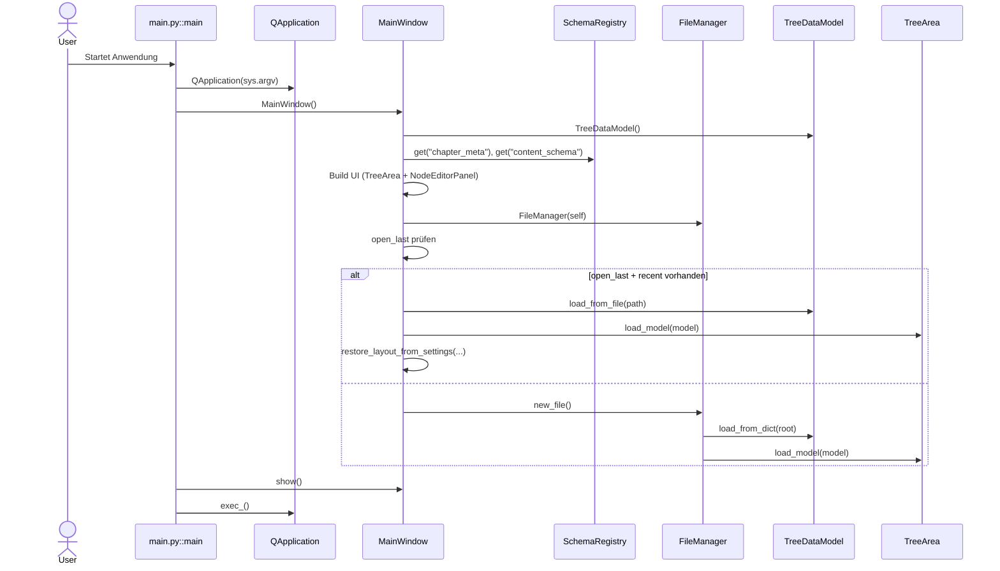
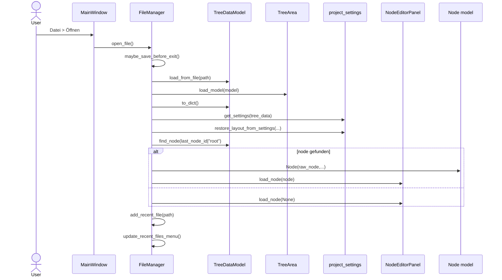
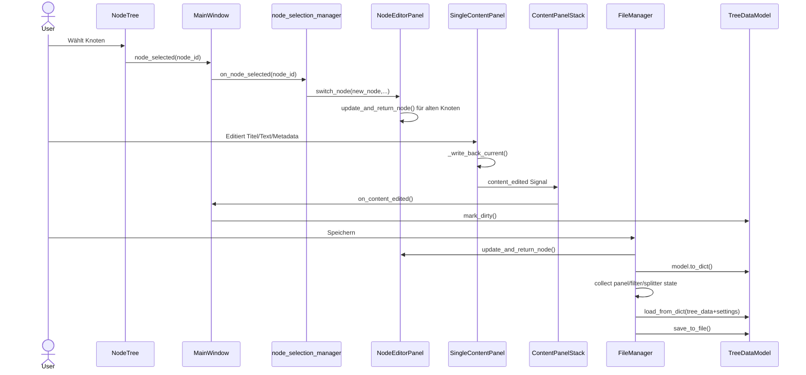

# Runtime-Flows (Sequence)

## A) App-Startup

**Basiert auf**
- `main.py::main`
- `ui/main_window.py::MainWindow.__init__`
- `core/schema_registry.py::SchemaRegistry.get`
- `ui/file_manager.py::new_file/open_file`

## B) Dokument öffnen/laden

**Basiert auf**
- `ui/file_manager.py::open_file`
- `models/tree_data.py::load_from_file`
- `core/project_settings.py::restore_layout_from_settings`
- `ui/node_editor_panel.py::load_node`

## C) Node/Edit/Save

**Basiert auf**
- `ui/tree_view.py::on_selection_changed`
- `ui/node_selection_manager.py::on_node_selected`
- `ui/node_editor_panel.py::switch_node/update_and_return_node`
- `widgets/single_content_panel.py::_write_back_current`
- `ui/file_manager.py::save_file`

