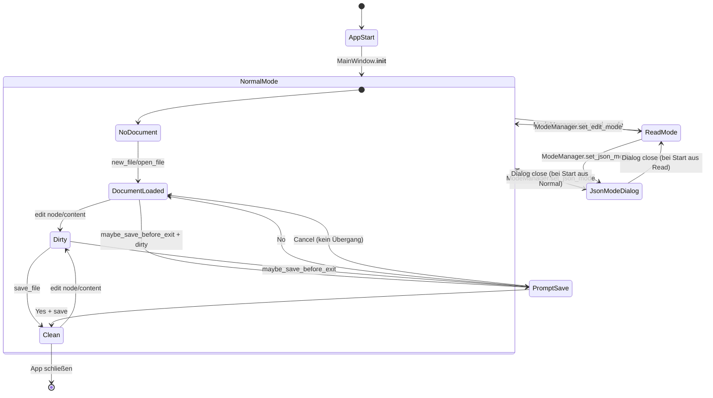

# Zustandsmodell (vereinfachte State Machine)

**Legende**
- Modelliert UI-/Editor-Zustände auf hoher Ebene.
- `dirty` bezieht sich auf `TreeDataModel._dirty` und/oder Editor-Änderungen.

**Basiert auf**
- `ui/mode_manager.py::ModeManager`
- `ui/file_manager.py` (`maybe_save_before_exit`, `open_file`, `save_file`, `new_file`)
- `models/tree_data.py` (`mark_dirty`, `mark_clean`)
- `widgets/single_content_panel.py::_write_back_current`

